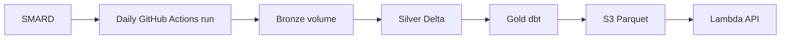

# spotgrid-lakehouse

Lakehouse for German power-market data.

[](https://github.com/varunhs306/spotgrid-lakehouse/actions/workflows/ci.yml)
[](https://github.com/varunhs306/spotgrid-lakehouse/actions/workflows/daily.yml)

## What it does

- Fetches day-ahead prices, grid load, wind and solar generation and their forecasts from SMARD every day.
- Lands the raw payloads unchanged in bronze, merges them into silver with PySpark and Delta (counting every changed value), and builds gold tables with dbt on Databricks.
- Exports gold to S3 as Parquet and serves it through a public API on AWS Lambda that never touches the warehouse.

## Architecture



## Live

- API: <https://lrmxrrzm5fqfig7qxtdovjnxju0gxclv.lambda-url.us-east-1.on.aws/docs>
  - `/v1/prices`, `/v1/prices/daily`, `/v1/load`, `/v1/generation`: `?start=YYYY-MM-DD&end=YYYY-MM-DD`, local dates in Europe/Berlin
  - `/v1/freshness`: when the data was last exported and how far it reaches
- Daily runs: [Actions](https://github.com/varunhs306/spotgrid-lakehouse/actions/workflows/daily.yml)

## Run locally

```sh
uv sync
uv run pytest
uv run python scripts/build_lambda.py     # API Lambda zip
```

Workspace, pipeline and export setup: [runbooks](docs/runbooks).

## Data

Bundesnetzagentur | SMARD.de, licensed under
[CC BY 4.0](https://creativecommons.org/licenses/by/4.0/). The tables and the API aggregate the
published values and derive new ones (such as residual load). Provided as is, without warranty of
correctness or completeness.
